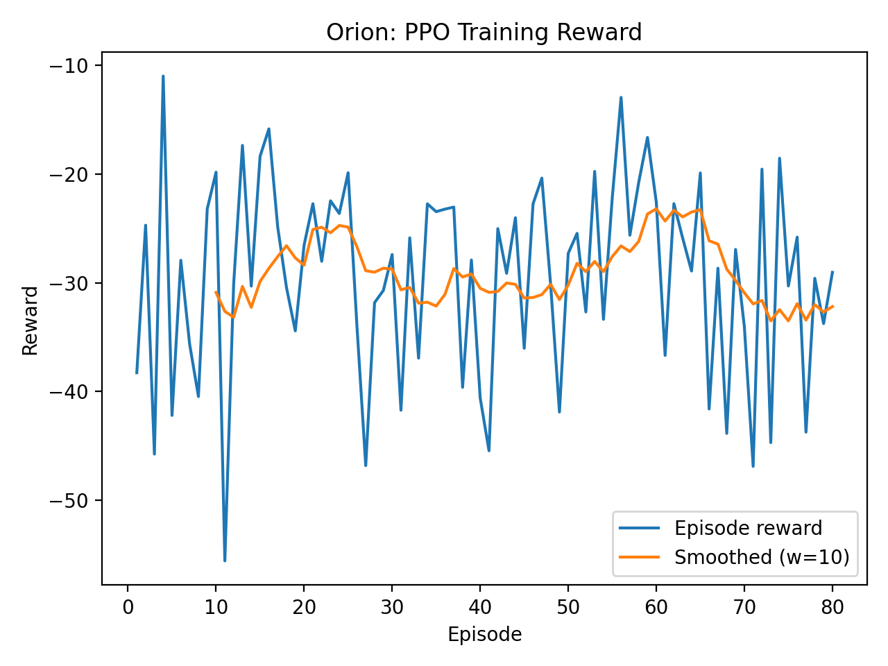
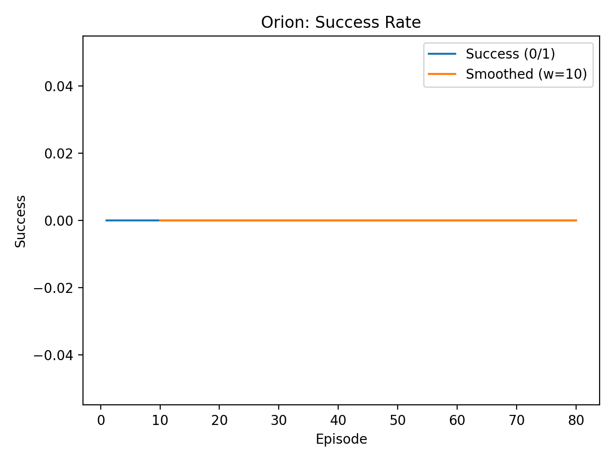
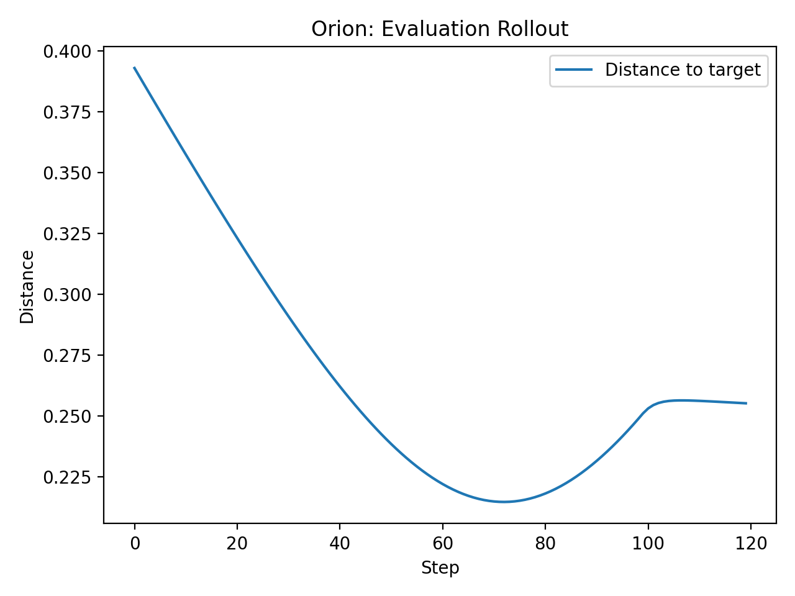

# Orion: Language-Conditioned Robotic Manipulation

**Orion** is a deep reinforcement learning framework for training an embodied AI agent to perform robotic manipulation tasks based on natural language commands. The agent processes visual information from a simulated environment and a text-based instruction to execute complex actions, such as picking, placing, and stacking objects.

This project integrates three core AI domains:
* **🤖 Reinforcement Learning:** Utilizes Proximal Policy Optimization (PPO) for stable policy learning in a continuous control environment.
* **👁️ Computer Vision:** Employs a pre-trained ResNet-18 to extract salient features from environmental camera images.
* **🧠 Natural Language Processing:** Uses a pre-trained DistilBERT model from Hugging Face to encode natural language instructions into actionable vector representations.

---
## Demonstration

The agent's goal is to interpret a command, like "place the blue object on the red area," and execute the corresponding actions.

*Note: The following is an illustrative GIF representing the project's objective.*
<p align="center">
  
</p>

---
## Environment

The project uses the PyBullet physics simulator. The environment consists of a tabletop, a Kuka IIWA robot arm, and several objects. The agent receives visual input from a simulated camera, which provides RGB, depth, and segmentation data.

<p align="center">
  
</p>

---

## Architecture

The agent's "brain" is a multi-modal policy network that fuses information from the vision and language modalities before making a decision.

1.  **Environment:** A simulated tabletop scene built using **PyBullet**.
2.  **Vision Module:** A frozen **ResNet-18** processes 128x128 pixel images from the simulator's camera.
3.  **Language Module:** A frozen **DistilBERT** model processes the text command.
4.  **Fusion & Policy:** The vision and language vectors are concatenated and fed into a 2-layer MLP which serves as the shared Actor-Critic network for the PPO algorithm.

---

## 📈 Results

This section summarizes training behavior and rollout-level evaluation signals produced by the current PPO setup.

### PPO Training Reward

<p align="center">
  
</p>

The reward is shaped primarily by a distance term between the end-effector and the target (distance-based shaping typically yields negative rewards).  
A trend toward higher reward (less negative) indicates the policy is reducing distance to the goal more consistently across episodes. The smoothed curve helps visualize overall learning dynamics under stochastic exploration.

---

### Success Rate

<p align="center">
  
</p>

Success is defined as reaching within a fixed tolerance of the target. This plot shows the per-episode binary success signal along with a moving average to highlight stability and convergence behavior over training. In the current run, the agent reduces distance but does not consistently satisfy the success threshold, highlighting the need for additional reward shaping, longer training, or curriculum.


---

### Evaluation Rollout (Distance-to-Target)

<p align="center">
  
</p>

Distance-to-target over time provides an interpretable view of control behavior. A decreasing curve suggests the policy is moving toward the target; plateaus or rebounds indicate instability, insufficient precision, or the need for reward/action scaling adjustments.

---

## Setup & Usage

**1. Clone the repository:**
```bash
git clone [https://github.com/your-username/Orion-Language-Conditioned-Robotic-Manipulation.git](https://github.com/your-username/Orion-Language-Conditioned-Robotic-Manipulation.git)
cd Orion-Language-Conditioned-Robotic-Manipulation
